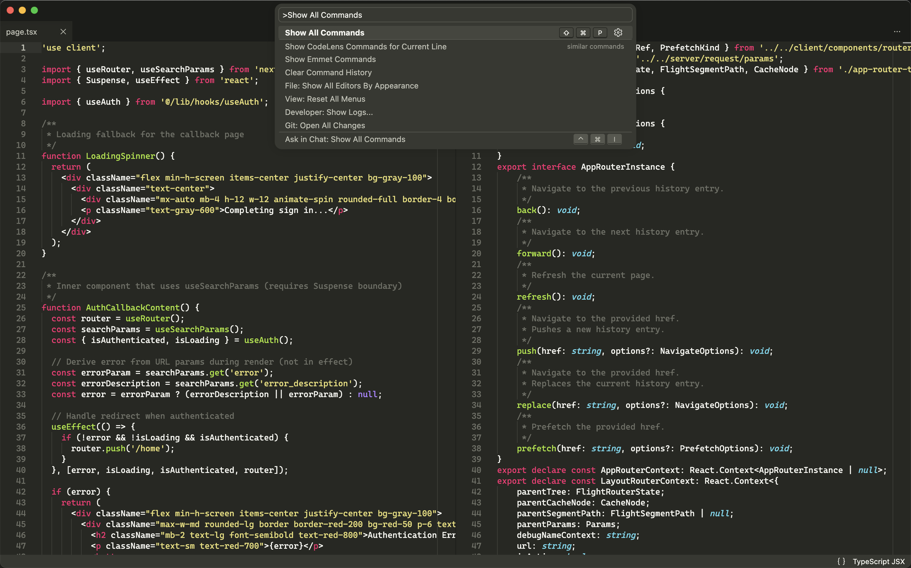

# Monokaizen (Mono改善)



## Description

A minimalist semantic dark theme inspired by 'Monokai Classic'.

This theme has been tailored to several languages to semantically highlight distinct elements of syntax.

## Color Semantics

- **White**: The main `foreground` color that applies to all basic tokens such as variables, namespaces, and operators.
- **Grey**: The `background` color for tokens which serve to annotate code, notably comments.
- **Red**: For `reserved` language-specific tokens like keywords and tags.
- **Green**: For `toxic` tokens which can mutate or execute behavior, notably functions.
- **Purple**: For `epic` tokens which are atomic, immutable, or self-referencing such as Integers, Booleans, Regular Expressions, and Atoms.
- **Cyan**: For `blueprint` tokens which support typing in a language such as primitive type elements.
- **Yellow**: The `mellow` color that applies to high-frequency tokens such as quoted string values in all languages.

## Tailored Language Extensions
- css
- erb
- html
- ini
- js
- json
- jsonc
- jsx
- py
- rb
- scss
- sh
- tf
- tfvars
- ts
- tsx
- xml
- yaml

## Recommendations

### CaskaydiaCove Nerd Font
For a good coding font check out `CaskaydiaCove` a fork of `Cascadia Code` by Microsoft. The Nerd Font enhanced variant can be found [here](https://www.nerdfonts.com/font-downloads)

### Settings
Additional settings to enhance the 'minimalist' experience:
```json
{
  "editor.bracketPairColorization.enabled": false,
  "editor.guides.highlightActiveIndentation": false,
  "editor.occurrencesHighlight": "off",
  "editor.renderLineHighlight": "gutter",
  "editor.semanticHighlighting.enabled": false,
  "workbench.iconTheme": null
}
```
